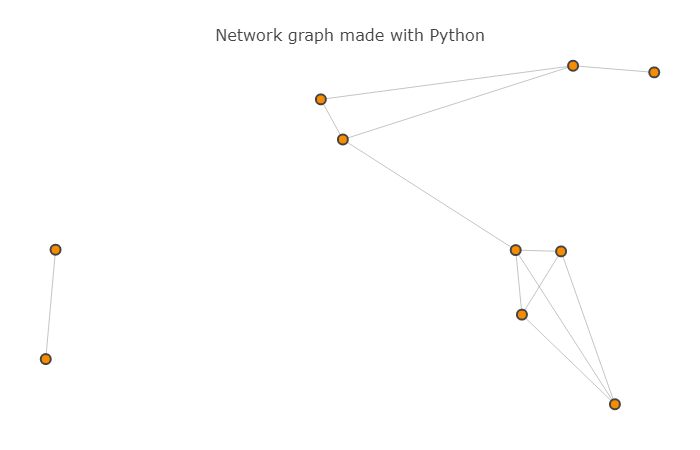
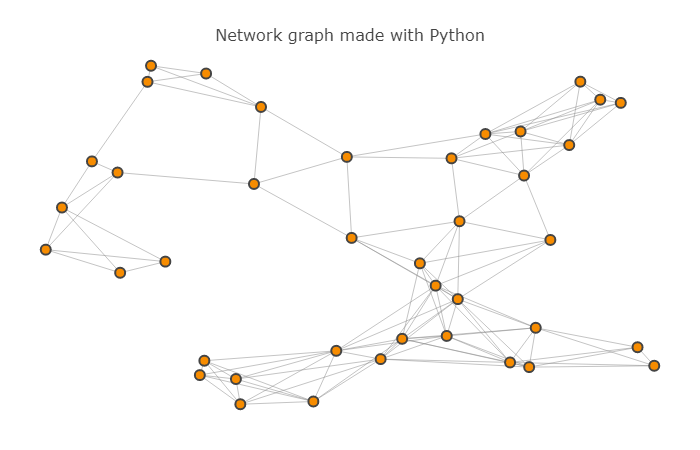
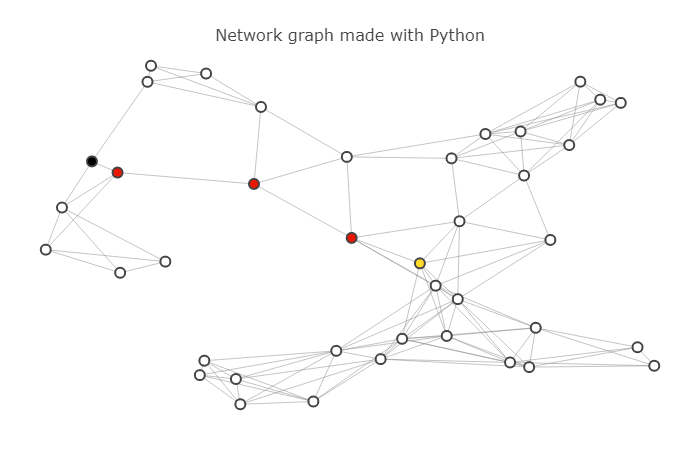

# Implement-A-star-route-planner
In this project A* search Algorithm is used to implement 'Google Maps' style routing planning.

## Installing Dependencies
* networkx - `pip install networkx==1.11`
* plotly   - `pip install plotly==2.7`

## A* search Algorithm
Learn about A* Search Algorithm [here](https://www.youtube.com/watch?v=ySN5Wnu88nE&t=633s)

# Maps used while testing
* Maps with 10 intersections

     
* Maps with 40 intersections

    

    
# Output on 40 intersection map
    
  `show_map(map_40, start=5, goal=34, path=[5,16,37,12,34])`
    
 
